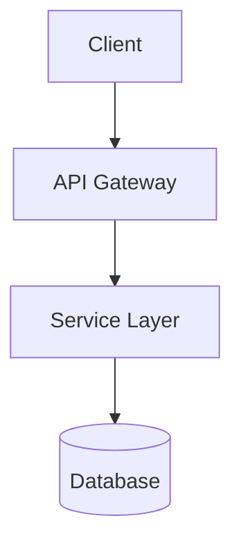
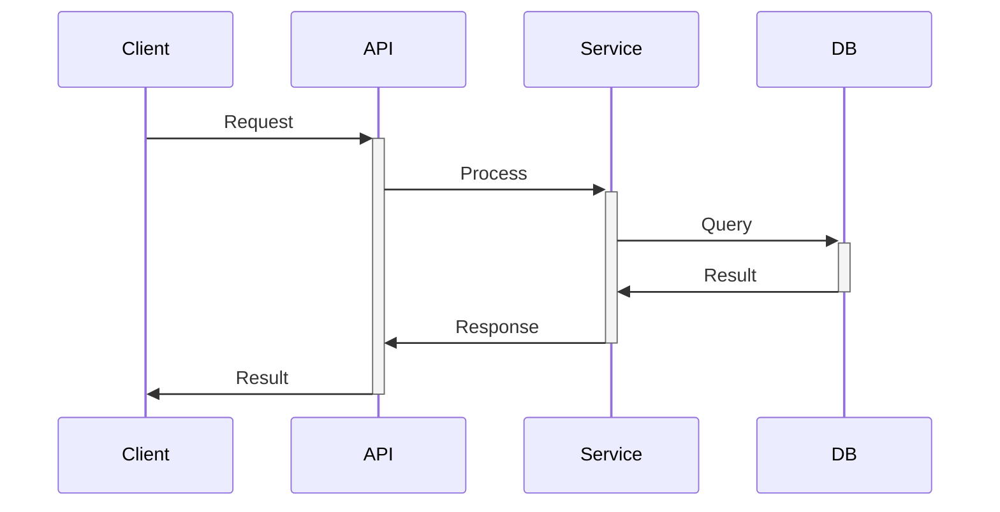

# Architecture Document

_Produced by Architect agent using Ralph loops_

---

## System Overview

High-level description of what this system does.

---

## Module Breakdown

| Module | Responsibility | LOC Estimate | Dependencies |
|--------|---------------|--------------|--------------|
| | | | |

---

## Data Flow

---

## Interface Contracts

### API Endpoints

| Method | Path | Request | Response |
|--------|------|-----------|----------|
| | | | |

### Internal Interfaces

| Module | Interface | Input | Output |
|--------|-----------|-------|--------|
| | | | |

---

## Stories

_Link to planner's STORIES_JSON or list here_

| Story ID | Title | LOC | Acceptance Criteria | RL Score |
|----------|-------|-----|---------------------|----------|
| | | | | |

---

_Ralph Loop Completion: RL Score must be >= 95_
